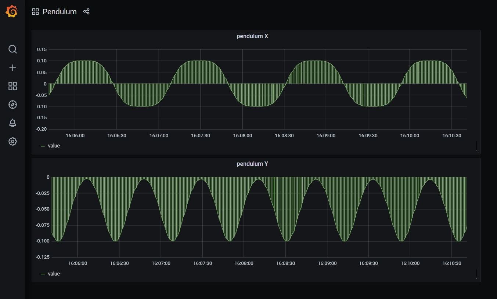

# Examples for DiTi platform

[DiTi](https://diti.dev) simplifies creation and maintenance of near real-time digital twins for IIoT.

## Example 1 : flow messages from AMQP to AMQP

Simple example of recieving messages in one AMQP queue and send them to another AMQP queue.

## Example 2 : simulation of 'simple pedulum'

Pendulum model from 'simplependulum.fmu' is simulated with 500ms steps.
Simulation data ('x' and 'y') is sens to Redis TimeSeries and them visualize in Grafana

